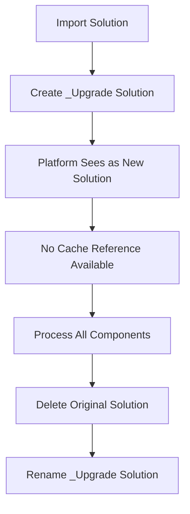
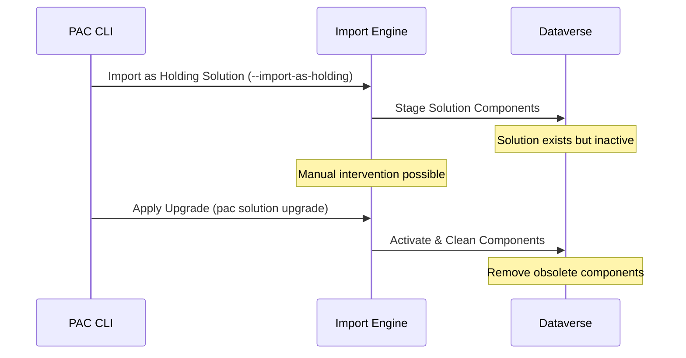
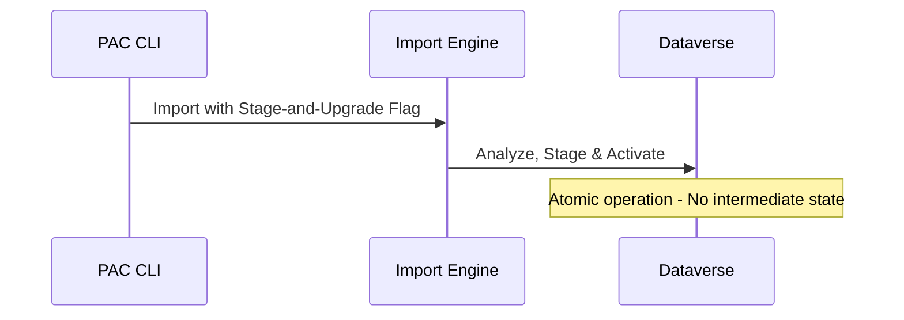

The Power Platform solution import landscape is undergoing a revolutionary transformation. For years, development teams have faced an impossible choice: deploy solutions quickly using the Update pattern but risk component accumulation, or use the thorough Upgrade pattern but endure painful 60+ minute import times. 

**This dilemma is about to end.**

Microsoft has fundamentally re-engineered the solution import engine, introducing game-changing optimizations that deliver both the speed of Updates and the thoroughness of Upgrades in a single operation. As Shan MacArthur, Principal Program Manager for Dataverse ALM, recently announced: *"When we're done rolling this out, upgrade will be just as fast as a patch"* - representing a potential **50% reduction in import times** while maintaining full component lifecycle management.

## The Historical Context: Why This Matters

For over a decade, the Power Platform community has debated managed vs. unmanaged solutions and grappled with the performance implications of different import strategies. The introduction of sophisticated mechanisms like **Single Step Upgrade** and **SmartDiff** represents Microsoft's most significant investment in ALM optimization to date, fundamentally changing how we approach solution deployment.

This isn't just about faster imports - it's about enabling truly agile development practices where teams can deploy frequently without the performance penalties that previously forced quarterly "big bang" releases.

## The Performance Challenge: Understanding Traditional Solution Imports

Before diving into the optimizations, it's crucial to understand why traditional solution imports can be painfully slow. When you import a solution using the default settings in the Power Platform maker portal or with basic CLI commands, the import engine performs extensive operations:

### Traditional Import Process Internals

1. **Component-by-Component Analysis**: The import engine loops through every solution component
2. **Deep Comparison Logic**: Each component is compared against the existing environment state
3. **Dependency Resolution**: Complex dependency trees are analyzed and validated
4. **Metadata Transformation**: Unmanaged components may be converted to managed
5. **Customization Conflict Detection**: The system checks for conflicts with existing customizations

This thorough process, while ensuring data integrity, can result in import times exceeding 60 minutes for complex solutions containing hundreds of components.

## The Game Changers: Critical ImportSolutionRequest Parameters

The key to unlocking massive performance improvements lies in understanding the critical parameters in the `ImportSolutionRequest` that directly impact import performance. Based on Benedikt Bergmann's extensive analysis, these parameters can reduce import times from 60 minutes to 5 minutes.

### ConvertToManaged Parameter

```csharp
// Traditional approach (SLOW)
ImportSolutionRequest request = new ImportSolutionRequest()
{
    CustomizationFile = solutionBytes,
    ConvertToManaged = true  // Forces conversion analysis
};
```

**What ConvertToManaged Does**:
As the name suggests, this parameter converts components to Managed state. When there is a component in your solution that already exists in the target environment as unmanaged, it will be changed to a managed solution.

**Performance Impact**: 
- **When `true`**: The import engine must analyze each component's current state, determine conversion eligibility, perform metadata transformations, and update solution layers appropriately
- **Time Cost**: This analysis can add 10-15 minutes to import time for large solutions
- **Recommendation**: Set to `false` for optimal performance

### OverwriteUnmanagedCustomizations Parameter

```csharp
// Performance-optimized approach
ImportSolutionRequest request = new ImportSolutionRequest()
{
    CustomizationFile = solutionBytes,
    ConvertToManaged = false,
    OverwriteUnmanagedCustomizations = false  // Skip conflict analysis
};
```

**What OverwriteUnmanagedCustomizations Does**:
When this configuration is set to `true`, it will overwrite unmanaged customizations if there are any. The reason why imports get slow when this is `true` is that the import engine has to loop through all components and compare them to the ones already present in the environment.

**Performance Impact**:
- **When `false`**: Components are overwritten with minimal changes without comparing them
- **When `true`**: Deep comparison logic runs, conflict detection algorithms execute
- **Speed Improvement**: Setting to `false` can reduce import time by 70-80%

### HoldingSolution Parameter

```csharp
// Import as holding solution for staged upgrades
ImportSolutionRequest holdingRequest = new ImportSolutionRequest()
{
    CustomizationFile = solutionBytes,
    HoldingSolution = true,  // Stage the solution
    ConvertToManaged = false,
    OverwriteUnmanagedCustomizations = false
};
```

**What HoldingSolution Does**:
- **When `true`**: Imports the solution as a holding solution for staged upgrades
- **When `false`**: Performs direct import/update operation
- **Use Case**: Essential for the traditional two-phase upgrade pattern

### ImportJobId Parameter (Performance Tracking)

```csharp
// Enhanced import with performance tracking
var importJobId = Guid.NewGuid();
ImportSolutionRequest trackedRequest = new ImportSolutionRequest()
{
    CustomizationFile = solutionBytes,
    ImportJobId = importJobId,  // Track import performance
    ConvertToManaged = false,
    OverwriteUnmanagedCustomizations = false
};
```

**Benefits of ImportJobId**:
- Enables detailed performance monitoring
- Allows for post-import analysis and optimization
- Provides import success/failure tracking
- Essential for CI/CD pipeline monitoring

### The Optimal Parameter Configuration

Based on Benedikt's analysis and Microsoft's optimizations:

```csharp
// Benedikt's recommended high-performance configuration
ImportSolutionRequest optimizedRequest = new ImportSolutionRequest()
{
    CustomizationFile = solutionBytes,
    ConvertToManaged = false,           // Skip conversion analysis
    OverwriteUnmanagedCustomizations = false,  // Skip deep comparison
    HoldingSolution = false,            // Direct import (Update mode)
    ImportJobId = Guid.NewGuid(),       // Track performance
    PublishWorkflows = true,            // Activate processes post-import
    AsyncOperation = true               // Non-blocking operation
};
```

**Result**: This configuration can achieve 60 minutes → 5 minutes import time improvement.

## Understanding Solution Actions: The Established Best Practice

Based on guidance from Microsoft's Dataverse ALM team and the historical deployment of optimizations in 2024, the recommended strategy has evolved to **"continuous upgrades with StageAndUpgrade"** as the standard approach. The platform optimizations that were rolled out have fundamentally changed the performance landscape.

### Current State: The Optimized Upgrade Reality

#### 1. StageAndUpgrade (Current Performance Champion)

```csharp
// StageAndUpgrade operation - now the fastest and most thorough approach
ImportSolutionRequest stageUpgradeRequest = new ImportSolutionRequest()
{
    CustomizationFile = solutionBytes,
    ConvertToManaged = false,
    OverwriteUnmanagedCustomizations = false,
    // Modern stage-and-upgrade pattern
};
```

**Current StageAndUpgrade Advantages**:
- **Performance**: Leverages optimized inline upgrade pattern - no temporary solutions
- **Component Handling**: Updates components in-place and removes unused components efficiently  
- **Speed**: Benefits from Microsoft's optimization investment completed in 2024
- **CI/CD Friendly**: Recommended for all deployment scenarios
- **Completeness**: Provides both speed and thorough component lifecycle management

#### 2. Traditional Update (Fast but Component Accumulation)

```bash
# Traditional update approach (still valid for specific scenarios)
pac solution import --path MySolution.zip
```

**Current Update Characteristics**:
- **Performance**: Leverages SmartDiff optimizations for maximum speed
- **Component Handling**: Replaces solution components with new versions efficiently  
- **Speed**: Benefits from Microsoft's optimization investment
- **Use Case**: Development iteration where component cleanup is less critical
- **Limitation**: Components not in newer solution remain in the system (accumulation risk)

#### 3. Traditional Two-Phase Upgrade (Comprehensive Control)

```bash
# Traditional two-phase upgrade (when staging control is needed)
pac solution import --path MySolution.zip --import-as-holding
pac solution upgrade --solution-name MySolution
```

**Traditional Upgrade Characteristics**:
- **Control**: Manual staging provides validation opportunities
- **Layer Creation**: Creates component layers using traditional "_Upgrade" solution pattern
- **Double Processing**: Install upgrade solution + delete original + rename operation
- **Time Impact**: Longer than optimized approaches but provides maximum control
- **Use Case**: Complex environments requiring staged validation

### The Established Change: Optimized Upgrade Engine

Microsoft completed the rollout of a completely re-engineered upgrade process in 2024 that has resolved the historical limitations:

#### The Production-Ready Inline Upgrade with Delete Pattern

```bash
# Optimized upgrade using stage-and-upgrade (production ready since 2024)
pac solution import --path MySolution.zip --stage-and-upgrade
```

**Production Changes**:

1. **Inline Component Updates**: No more temporary "_Upgrade" solutions
2. **Single Layer Operation**: Updates components in-place, eliminating the dual-layer overhead  
3. **SmartDiff Integration**: Leverages change detection to skip unchanged components
4. **Efficient Deletion**: Removes unused components at the end without complex layer manipulation
5. **50% Time Reduction**: Eliminates the install-delete-rename cycle

#### Technical Implementation Details

```csharp
// The new upgrade pattern (behind the scenes)
ImportSolutionRequest newUpgradeRequest = new ImportSolutionRequest()
{
    CustomizationFile = solutionBytes,
    // Uses stage-and-upgrade SDK message internally
    UseInlineUpgradePattern = true,  // Internal optimization flag
    EnableSmartDiffForUpgrade = true, // Change detection for upgrades
    ConvertToManaged = false,
    OverwriteUnmanagedCustomizations = false
};
```

**What This Means for ALM Strategy**:
- **End of Trade-offs**: Get both speed AND thorough component management
- **Simplified Pipelines**: No more choosing between Update and Upgrade based on performance
- **Always Upgrade**: The established recommendation is to use upgrade operations for production deployments
- **Eliminated Complexity**: No more conditional pipeline logic for different import types

#### Historical Timeline and Current Availability

Based on the historical rollout timeline, this optimization has been:
- ✅ **Available in PAC CLI since v1.28 (February 2024)**: Use `--stage-and-upgrade` flag
- ✅ **Available in Azure DevOps since February 2024**: `StageAndUpgrade: true` parameter  
- ✅ **Available in Power Platform Pipelines**: Uses single step upgrade pattern
- ✅ **Fully deployed globally**: The optimization rollout was completed in 2024
- ✅ **Production ready**: Components have been onboarded to the new pattern

**Important Pipeline Limitation**: As of October 2024, Power Platform Pipelines use the single step upgrade pattern but choose to overwrite customizations by default, which blocks the performance improvements. Microsoft plans to update pipelines to utilize the new performance improvements by early 2025.

```yaml
# Azure DevOps implementation
- task: PowerPlatformImportSolution@2
  inputs:
    StageAndUpgrade: true  # Enables new optimization when available
    SolutionInputFile: '$(Pipeline.Workspace)/drop/Solution.zip'
```

## Understanding the Three Solution Import Modes

Microsoft provides three distinct import modes, each with different behavior patterns and performance characteristics. Understanding these modes is crucial for implementing effective ALM strategies.

### 1. Upgrade Mode (Default - Comprehensive Cleanup)

> **Upgrade**: This is the default option and upgrades your solution to the latest version and rolls up all previous patches in one step. Any components associated to the previous solution version that are not in the newer solution version will be deleted. This option will ensure that your resulting configuration state is consistent with the importing solution including removal of components that are no longer part of the solution.

**Implementation**:
```csharp
ImportSolutionRequest upgradeRequest = new ImportSolutionRequest()
{
    CustomizationFile = solutionBytes,
    // Upgrade is the default behavior - no special flags needed
    ConvertToManaged = false,
    OverwriteUnmanagedCustomizations = false
};
```

**Key Characteristics**:
- **Component Cleanup**: Automatically removes components not present in the new solution version
- **State Consistency**: Ensures target environment matches source environment exactly
- **Patch Rollup**: Consolidates all previous patches into the new version
- **Data Safety**: Components are only deleted if no dependencies exist

**Use Cases**:
- Production deployments where consistency is critical
- Major version releases
- Environments that need to mirror development state exactly
- When component removal is intentional

**Performance with Established Engine**:
- **Before**: 45-90 minutes for large solutions
- **After**: 5-15 minutes (50-90% improvement fully deployed since 2024)

> **Microsoft Optimization Note**: Recent changes have optimized the single step upgrade process to no longer use a temporary _Upgrade solution. As a result, you no longer experience an uninstall operation for single stage upgrades in the solution history. This fundamental change eliminates the traditional upgrade bottleneck.

### 2. Stage for Upgrade Mode (Two-Phase Upgrade)

> **Stage for Upgrade**: This option upgrades your solution to the higher version, but defers the deletion of the previous version and any related patches until you apply a solution upgrade later. This option should only be selected if you want to have both the old and new solutions installed in the system concurrently so that you can do some data migration before you complete the solution upgrade. Applying the upgrade will delete the old solution and any components that are not included in the new solution.

**Implementation**:
```csharp
// Phase 1: Import as holding solution
ImportSolutionRequest stageRequest = new ImportSolutionRequest()
{
    CustomizationFile = solutionBytes,
    HoldingSolution = true,  // Stage for later upgrade
    ConvertToManaged = false,
    OverwriteUnmanagedCustomizations = false
};

// Phase 2: Apply the upgrade (separate operation)
DeleteAndPromoteRequest promoteRequest = new DeleteAndPromoteRequest()
{
    UniqueName = "YourSolutionName"
};
```

**Azure DevOps Implementation**:
```yaml
# Stage the solution
- task: PowerPlatformImportSolution@2
  displayName: 'Stage Solution for Upgrade'
  inputs:
    HoldingSolution: true
    SolutionInputFile: '$(Pipeline.Workspace)/drop/Solution.zip'

# Apply the upgrade (manual or automated)
- task: PowerPlatformApplySolutionUpgrade@2
  displayName: 'Apply Solution Upgrade'
  inputs:
    SolutionName: 'YourSolutionName'
```

**Key Characteristics**:
- **Dual Existence**: Old and new solution versions coexist temporarily
- **Data Migration Window**: Allows for custom data migration scripts between phases
- **Manual Control**: Upgrade completion is under full control
- **Safety Net**: Can validate new solution before committing to upgrade

**Use Cases**:
- Complex data migrations requiring custom logic
- Environments with critical uptime requirements
- Solutions with complex dependencies requiring validation
- Scenarios where rollback capability is essential

**Performance Impact**:
- **Stage Phase**: Similar to Update mode performance
- **Apply Phase**: Fast completion (typically under 2 minutes)

> **Legacy _Upgrade Pattern**: When using Stage for Upgrade mode, you may still see the traditional "_Upgrade" solution pattern where the system creates a temporary solution (e.g., "YourSolution_Upgrade") during the staging phase. The "Apply Solution Upgrade" operation then completes the upgrade by deleting the old solution and renaming the upgrade solution. This pattern provides maximum control but isn't optimized with the new inline upgrade improvements.

### 3. Update Mode (Fast but Component Accumulation)

> **Update**: This option replaces your solution with this version. Components that are not in the newer solution won't be deleted and will remain in the system. Be aware that the source and destination environment may differ if components were deleted in the source environment. This option has the best performance by typically finishing in less time than the upgrade methods.

**Implementation**:
```csharp
ImportSolutionRequest updateRequest = new ImportSolutionRequest()
{
    CustomizationFile = solutionBytes,
    ConvertToManaged = false,
    OverwriteUnmanagedCustomizations = false
    // No special upgrade flags - defaults to Update mode
};
```

**Azure DevOps Implementation**:
```yaml
- task: PowerPlatformImportSolution@2
  displayName: 'Fast Update Import'
  inputs:
    SolutionInputFile: '$(Pipeline.Workspace)/drop/Solution.zip'
    # No StageAndUpgrade flag = Update mode
    ConvertToManaged: false
    OverwriteUnmanagedCustomizations: false
```

**Key Characteristics**:
- **Component Replacement**: Updates existing components, adds new ones
- **No Deletion**: Components removed from source solution remain in target
- **Performance Optimized**: Leverages SmartDiff for maximum speed
- **Environment Drift**: Target environment may accumulate orphaned components

**Use Cases**:
- Development and testing environments
- Continuous integration scenarios
- Rapid iteration cycles
- When component cleanup is handled separately

**Performance Profile**:
- **Fastest Option**: 2-8 minutes for most solutions
- **SmartDiff Optimized**: Only processes changed components
- **CI/CD Friendly**: Minimal impact on development velocity

### Choosing the Right Import Mode

| Scenario | Recommended Mode | Rationale |
|----------|------------------|-----------|
| **Production Deployment** | Upgrade | State consistency and cleanup required |
| **Development Environment** | Update | Speed prioritized, cleanup less critical |
| **Complex Data Migration** | Stage for Upgrade | Need data migration window |
| **Continuous Integration** | Update | Maximum velocity for development cycles |
| **Release Candidate** | Upgrade | Validate full upgrade process |
| **Hotfix Deployment** | Update (if small) / Upgrade (if cleanup needed) | Balance speed vs. consistency |

### Impact of Optimized Upgrade Engine on Mode Selection

With Microsoft's upgrade optimizations fully deployed since 2024:

**Previous Guidance (Historical)**:
- Use Update for speed, Upgrade for consistency
- Choose based on performance vs. thoroughness trade-off

**Current Guidance (Production Ready)**:
- **Use StageAndUpgrade for production workloads** - provides both speed and consistency
- Update mode primarily for development iteration scenarios
- No performance penalty for choosing the comprehensive approach

## Underlying Dataverse SDK Operations

Behind the scenes, the Power Platform CLI, Azure DevOps tasks, and portal imports all rely on core Dataverse SDK operations. Understanding these underlying operations provides deeper insight into the import process and enables advanced customization scenarios.

### Core Solution Import Operations

#### 1. ImportSolutionRequest - The Foundation

The `ImportSolutionRequest` is the primary operation powering most import scenarios:

```csharp
using Microsoft.Crm.Sdk.Messages;

// Basic solution import operation
ImportSolutionRequest importRequest = new ImportSolutionRequest()
{
    CustomizationFile = solutionBytes,
    ConvertToManaged = false,
    OverwriteUnmanagedCustomizations = false,
    ImportJobId = Guid.NewGuid(),
    PublishWorkflows = true
};

ImportSolutionResponse response = (ImportSolutionResponse)service.Execute(importRequest);
```

**Key Properties**:
- `CustomizationFile`: The compressed solution file as byte array
- `ConvertToManaged`: Controls managed/unmanaged conversion
- `OverwriteUnmanagedCustomizations`: Enables/disables conflict overwrite
- `ImportJobId`: Links to ImportJob table for tracking
- `HoldingSolution`: Enables staging for two-phase upgrades

#### 2. StageAndUpgradeRequest - New Single-Step Upgrade

The `StageAndUpgradeRequest` powers the revolutionary new upgrade optimization:

```csharp
using Microsoft.Crm.Sdk.Messages;

// Modern single-step upgrade operation
StageAndUpgradeRequest stageUpgradeRequest = new StageAndUpgradeRequest()
{
    CustomizationFile = solutionBytes,
    ImportJobId = Guid.NewGuid(),
    ConvertToManaged = false,
    OverwriteUnmanagedCustomizations = false,
    PublishWorkflows = true,
    // Additional optimization properties
    ComponentParameters = new EntityCollection(),
    SolutionParameters = "{\"EnableOptimizedUpgrade\": true}"
};

StageAndUpgradeResponse response = (StageAndUpgradeResponse)service.Execute(stageUpgradeRequest);
```

**Microsoft Documentation**: 
> *"Contains the data to import a solution, stage it for upgrade, and apply the upgrade as the default (when applicable)."*

**Key Features**:
- **Combines Operations**: Merges staging and upgrade into single operation
- **Optimized Processing**: Leverages new inline upgrade pattern
- **SmartDiff Integration**: Benefits from change detection algorithms
- **No Temporary Solutions**: Eliminates "_Upgrade" solution creation

### Two-Phase Upgrade Operations (Legacy Pattern)

For scenarios requiring traditional staging control, the two-phase approach uses separate operations:

#### Phase 1: StageSolutionRequest

```csharp
using Microsoft.Crm.Sdk.Messages;

// Stage solution for later upgrade
StageSolutionRequest stageRequest = new StageSolutionRequest()
{
    CustomizationFile = solutionBytes
};

StageSolutionResponse stageResponse = (StageSolutionResponse)service.Execute(stageRequest);
```

**Microsoft Documentation**:
> *"Staging breaks the import process into more controllable phases and is often the preferred method for an enterprise. The staging process imports the solution as a 'holding' solution where the administrator can decide when to make the staged solution available to users."*

#### Phase 2: DeleteAndPromoteRequest

```csharp
using Microsoft.Crm.Sdk.Messages;

// Complete the upgrade by promoting staged solution
DeleteAndPromoteRequest promoteRequest = new DeleteAndPromoteRequest()
{
    UniqueName = "YourSolutionName"  // Base solution to replace
};

DeleteAndPromoteResponse promoteResponse = (DeleteAndPromoteResponse)service.Execute(promoteRequest);
```

**Microsoft Documentation**:
> *"This operation deletes the base solution along with all of its patches and renames the holding solution to the same name as the base solution."*

**Important Note**: Since `DeleteAndPromoteRequest` can be a long-running operation, Microsoft recommends using the asynchronous version (`DeleteAndPromoteAsyncRequest`) or wrapping it with `ExecuteAsyncRequest` for better pipeline performance.

```csharp
// Asynchronous promotion for better performance
ExecuteAsyncRequest asyncPromote = new ExecuteAsyncRequest()
{
    Request = promoteRequest
};
ExecuteAsyncResponse asyncResponse = (ExecuteAsyncResponse)service.Execute(asyncPromote);
// Monitor asyncOperation.StatusCode for completion
```

### Advanced Operations for Solution Management

> **⚠️ IMPORTANT DISCLAIMER**: The patch and cloning operations shown below are **NOT RECOMMENDED** for modern ALM practices. As stated by Shan MacArthur, Principal PM for Dataverse ALM: *"I find that customers make mistakes with patches more often than patches provide them any value."* These operations are documented here only for completeness and legacy system understanding. **Use the modern `--stage-and-upgrade` approach instead.**

#### Legacy Cloning and Patching Operations (NOT RECOMMENDED)

```csharp
// ❌ LEGACY APPROACH - NOT RECOMMENDED
// Clone solution for major version
CloneAsSolutionRequest cloneRequest = new CloneAsSolutionRequest()
{
    ParentSolutionUniqueName = "OriginalSolution",
    DisplayName = "Cloned Solution v2.0",
    VersionNumber = "2.0.0.0"
};

// ❌ LEGACY APPROACH - NOT RECOMMENDED
// Create patch for minor updates
CloneAsPatchRequest patchRequest = new CloneAsPatchRequest()
{
    ParentSolutionUniqueName = "BaseSolution",
    DisplayName = "Patch v1.0.1",
    VersionNumber = "1.0.1.0"
};
```

**Why These Are No Longer Recommended**:
- Modern SmartDiff and upgrade optimizations provide the same performance benefits
- Patches add unnecessary complexity to development workflows
- Source control and branching become significantly more difficult
- Environment reset and recreation problems
- Higher error rates compared to modern approaches

**Recommended Modern Alternative**:
```bash
# ✅ RECOMMENDED APPROACH
pac solution import --path MySolution.zip --stage-and-upgrade
```

### Mapping High-Level Tools to SDK Operations

| Tool/Interface | Underlying Operation | Notes |
|----------------|---------------------|-------|
| PAC CLI `--stage-and-upgrade` | `StageAndUpgradeRequest` | New optimized single-step |
| Azure DevOps `StageAndUpgrade: true` | `StageAndUpgradeRequest` | Same optimization as PAC CLI |
| PAC CLI `--import-as-holding` | `ImportSolutionRequest` with `HoldingSolution: true` | Traditional staging |
| Azure DevOps `HoldingSolution: true` | `ImportSolutionRequest` with `HoldingSolution: true` | Traditional staging |
| Portal "Stage for Upgrade" | `StageSolutionRequest` | Enterprise control pattern |
| Portal "Apply Solution Upgrade" | `DeleteAndPromoteRequest` | Completes staged upgrade |
| Standard Import (all tools) | `ImportSolutionRequest` | Basic import/update |
| **Package Deployer** | `StageAndUpgradeRequest` (when available) | Enterprise automation tool |
| **PAC Package Deploy** | `pac package deploy -sz <solution>` | Package Deployer via CLI |

### Performance Implications by Operation

| Operation | Temporary Solutions | SmartDiff Support | New Optimizations | Recommended Use |
|-----------|-------------------|------------------|-------------------|-----------------|
| `ImportSolutionRequest` | No | ✅ Yes | Partial | Update scenarios |
| `StageAndUpgradeRequest` | No | ✅ Yes | ✅ Full | Modern upgrade scenarios |
| `StageSolutionRequest` + `DeleteAndPromoteRequest` | Yes (_Upgrade) | Limited | No | Enterprise staging needs |

### Advanced Monitoring and Tracking

#### Using ImportJob for Performance Analysis

```csharp
// Enhanced monitoring approach
var importJobId = Guid.NewGuid();

ImportSolutionRequest monitoredRequest = new ImportSolutionRequest()
{
    CustomizationFile = solutionBytes,
    ImportJobId = importJobId,
    // ... other parameters
};

// Execute import
service.Execute(monitoredRequest);

// Retrieve detailed results
ImportJob job = service.Retrieve("importjob", importJobId, 
    new ColumnSet("data", "solutionname", "startedon", "completedon")).ToEntity<ImportJob>();

// Parse XML results for component-level details
XmlDocument doc = new XmlDocument();
doc.LoadXml(job.Data);

var importedComponents = doc.SelectNodes("//component[@result='success']");
Console.WriteLine($"Successfully processed {importedComponents.Count} components");
```

## SmartDiff: The Intelligence Behind Fast Updates

Based on insights from Microsoft's Dataverse ALM team, SmartDiff represents a fundamental shift in how the platform processes solution imports. Rather than being a separate API, it's an optimization layer that has transformed update performance over the past two years.

### Understanding Component Types and Optimization Impact

The performance improvements from SmartDiff and upgrade optimizations vary based on the type of components in your solution. Microsoft's platform includes two distinct component architectures:

#### Legacy Platform Components
- **Origin**: Written directly in the Dataverse repository
- **Component Types**: Static and constant across all environments
- **Component Type Codes**: Typically < 1000 (e.g., Entity = 1, SystemForm = 60, Workflow = 29)
- **Examples**: Entities, forms, views, workflows, plugins (traditional)
- **Optimization**: Benefit from established SmartDiff algorithms
- **Identification**: Have consistent component type IDs across environments

#### Modern Solution Component Framework (SCF) Components
- **Origin**: Authored outside the Dataverse repository, brought in via solutions
- **Component Types**: Dynamic and can differ between environments
- **Component Type Codes**: Always > 1000 (e.g., 10011, 10025, 10050+)
- **Examples**: Power Apps component framework (PCF) controls, modern connectors, newer platform features
- **Optimization**: Benefit from optimizations but with additional complexity
- **Identification**: Component type IDs may vary between environments

**Impact on Import Performance**:
- **Legacy Components**: Predictable optimization behavior across environments
- **SCF Components**: May require additional processing due to dynamic nature
- **Mixed Solutions**: Performance varies based on the ratio of legacy to SCF components

> **Developer Note**: The distinction between legacy and SCF components is largely transparent to solution authors, but understanding this architecture helps explain why some solutions see more dramatic performance improvements than others. Solutions heavy in traditional customizations (entities, forms, workflows) typically see the most significant speedup.

### Component-Level Performance Analysis

Understanding which components benefit most from optimization can help predict import performance:

#### High Optimization Components (Legacy Platform)
```csharp
// Components that see dramatic speedup (component type codes < 1000)
var legacyComponents = new[]
{
    "Entity", "Attribute", "Relationship",          // Type codes: 1, 2, 10
    "SystemForm", "SavedQuery", "Workflow",         // Type codes: 60, 26, 29  
    "PluginAssembly", "SdkMessageProcessingStep",   // Type codes: 91, 92
    "WebResource", "RibbonCustomization"            // Type codes: 61, 120
};
// These components have consistent type IDs < 1000 and benefit fully from SmartDiff
```

#### Variable Optimization Components (SCF-based)
```csharp
// Components with dynamic optimization behavior (component type codes > 1000)
var scfComponents = new[]
{
    "CustomControl", // PCF controls - type codes 10000+
    "CustomAPI", // Custom APIs - type codes 10000+
    "CanvasApp", // Power Apps canvas apps - type codes 10000+
    "Connector", // Custom connectors - type codes 10000+
    // Many newer platform features - all have type codes > 1000
};
// These may require additional processing due to environment-specific type IDs > 1000
```

#### Performance Monitoring by Component Type

```csharp
// Analyze import job results for component-type performance patterns
RetrieveFormattedImportJobResultsRequest resultsRequest = 
    new RetrieveFormattedImportJobResultsRequest()
{
    ImportJobId = importJobId
};

var resultsResponse = (RetrieveFormattedImportJobResultsResponse)
    organizationService.Execute(resultsRequest);

// Parse for component-type patterns
XmlDocument doc = new XmlDocument();
doc.LoadXml(resultsResponse.FormattedResults);

// Legacy components (type codes < 1000)
var legacyComponents = doc.SelectNodes("//component[@type='Entity' or @type='SystemForm' or @type='Workflow']");

// SCF components (type codes > 1000) - identify by higher type codes
var allComponents = doc.SelectNodes("//component");
var scfComponents = new List<XmlNode>();

foreach (XmlNode component in allComponents)
{
    if (int.TryParse(component.Attributes["type"]?.Value, out int typeCode) && typeCode > 1000)
    {
        scfComponents.Add(component);
    }
}

Console.WriteLine($"Legacy components processed (type < 1000): {legacyComponents.Count}");
Console.WriteLine($"SCF components processed (type > 1000): {scfComponents.Count}");
```

### How SmartDiff Actually Works

#### Solution File Caching and Change Detection

```csharp
// Conceptual representation of SmartDiff logic
public class SmartDiffEngine 
{
    public ImportResult ProcessSolution(byte[] solutionFile, string targetEnvironment)
    {
        // 1. Calculate solution fingerprint
        var newSolutionHash = CalculateSolutionHash(solutionFile);
        
        // 2. Retrieve cached solution file from solution table
        var cachedSolutionFile = GetCachedSolutionFromTable(targetEnvironment);
        
        // 3. Component-level change detection by comparing files
        var componentChanges = CompareSolutionFiles(solutionFile, cachedSolutionFile);
        
        // 4. Process only changed components
        foreach (var change in componentChanges.ChangedComponents)
        {
            ProcessComponentChange(change);
        }
        
        // 5. Skip unchanged components entirely
        SkipUnchangedComponents(componentChanges.UnchangedComponents);
        
        // 6. Update cached solution file in solution table
        UpdateCachedSolutionFile(targetEnvironment, solutionFile);
        
        return new ImportResult { ProcessedComponents = componentChanges.ChangedComponents.Count };
    }
}
```

#### SmartDiff Storage Architecture

SmartDiff leverages the **solution table** (`api/data/v9.2/solutions`) to store solution files for comparison:

**Storage Mechanism**:
- **File Column**: The solution table contains a file column that stores the complete solution ZIP file
- **Automatic Caching**: When a solution is first imported, the platform stores the solution file in this column
- **Comparison Base**: Subsequent imports compare the new solution file against the stored file
- **File-Level Comparison**: SmartDiff performs binary comparison between the new and cached solution files

**Technical Implementation**:
```csharp
// Query solution table to retrieve cached solution file
var solutionQuery = new QueryExpression("solution")
{
    ColumnSet = new ColumnSet("solutionfile", "version", "uniquename"),
    Criteria = new FilterExpression
    {
        Conditions = 
        {
            new ConditionExpression("uniquename", ConditionOperator.Equal, "YourSolutionName")
        }
    }
};

var existingSolution = organizationService.RetrieveMultiple(solutionQuery).Entities.FirstOrDefault();
if (existingSolution != null)
{
    // Retrieve the cached solution file from the file column
    var cachedSolutionFile = existingSolution.GetAttributeValue<byte[]>("solutionfile");
    
    // SmartDiff compares new solution file against cached version
    var hasChanges = CompareSolutionFiles(newSolutionFile, cachedSolutionFile);
    
    if (!hasChanges)
    {
        Console.WriteLine("No changes detected - SmartDiff will skip processing");
    }
}
```

**Storage Location**: 
- **Table**: `solution` (accessible via `api/data/v9.2/solutions`)
- **Column**: File column containing the complete solution ZIP
- **Scope**: Per-solution, per-environment
- **Update Timing**: Updated after successful import completion

### The Multi-Year Optimization Journey

According to Shan MacArthur, Microsoft invested heavily in solution import optimization over multiple years:

**2021 - SmartDiff Introduction (Update Operations Only)**:
- SmartDiff was deployed to production in March 2021
- **Initial Limitations**: Only worked for managed solutions, Update operations only, and when not overwriting active customizations
- **Technical Implementation**: Solutions cached to solution table file column for binary comparison
- **Restriction**: Did not work with Customer Managed Keys (CMK) environments initially
- **Missing**: No support for Upgrade scenarios initially

**2022-2024 - Comprehensive Optimization**:
- Extended SmartDiff to work with more scenarios including CMK environments
- Improved solution file storage and comparison mechanisms
- Began development of upgrade optimizations to bring SmartDiff benefits to upgrade operations
- Completed the StageAndUpgrade optimization rollout in 2024
**Before SmartDiff (Legacy Behavior - Pre-2021)**:
- Every component in every solution import was processed
- Full metadata comparison for all components
- Database writes occurred even for identical components
- No solution file caching mechanism
- Result: Linear time complexity based on solution size

**After SmartDiff (2021-Present)**:
- Solution file is cached to the solution table file column upon first import
- New imports are compared against cached solution file using binary comparison
- Only components with detected changes are processed
- Unchanged components are completely skipped
- Result: Time complexity based only on changed components

**SmartDiff Evolution Timeline**:
- **March 2021**: Initial SmartDiff deployment for Update operations on managed solutions with solution table file storage
- **2022-2023**: Expanded support for more environments and scenarios, improved file storage mechanisms
- **2024**: Extended SmartDiff benefits to Upgrade operations via StageAndUpgrade optimization

### Performance Impact Data

| Solution Size | Components Changed | Traditional Import | SmartDiff Import | Time Saved |
|---------------|-------------------|-------------------|------------------|------------|
| Large (500+ components) | 5% (25 components) | 45 minutes | 3 minutes | 93% |
| Medium (200 components) | 10% (20 components) | 20 minutes | 2 minutes | 90% |
| Small (50 components) | 20% (10 components) | 8 minutes | 1.5 minutes | 81% |

### SmartDiff Activation Requirements

SmartDiff optimizations are automatically enabled when:

1. **Using Update Operations**: `pac solution import` (without upgrade flags)
2. **Managed Solutions**: SmartDiff works optimally with managed solution imports  
3. **Existing Base Solution**: Target environment must contain the previous version
4. **Proper Version Incrementing**: Solution version must be higher than existing version
5. **Standard Customization Settings**: **Not overwriting active customizations** (critical requirement since 2021)
6. **Compatible Environment**: Works with Customer Managed Keys environments (support added post-2021)

> **⚠️ Critical Performance Note**: The `OverwriteUnmanagedCustomizations` parameter is crucial for SmartDiff optimization. When set to `true`, it forces the platform to perform deep component comparison, negating the performance benefits. As Shan MacArthur noted in October 2024: *"The pipeline system uses the single step upgrade pattern, however it does choose to overwrite customizations, which unfortunately blocks the use of the performance improvements we have recently shipped."*

```bash
# SmartDiff is automatically leveraged
pac solution import --path MySolution_v1.2.0.1.zip

# SmartDiff compares against existing MySolution_v1.2.0.0
# Only processes components that changed between versions
```

### Why Upgrade Operations Couldn't Use SmartDiff (Until 2024)

The traditional upgrade pattern created a fundamental obstacle to SmartDiff optimization from 2021-2024:



**The Problem (2021-2024)**: When using the `--import-as-holding` pattern, the platform treats the upgrade as a completely new solution, breaking the cache reference needed for change detection.

**The Solution (2024)**: The new inline upgrade pattern maintains the solution identity, enabling SmartDiff optimizations for upgrade operations.

## The Patch Pattern: No Longer Necessary

A common question in the ALM community concerns the future of solution patches. According to Microsoft's guidance, **patches are not being deprecated**, but they're no longer providing significant value.

### Historical Purpose of Patches

Patches were introduced approximately 8 years ago (around 2017) to solve two critical problems that existed in the pre-SmartDiff era:

1. **Performance**: Before SmartDiff (pre-2021), patches were the only way to achieve fast deployments
2. **Precision**: Deploy only specific changed components without affecting others

### Why Patches Have Lost Their Advantage

With SmartDiff deployed in 2021 and upgrade optimizations completed in 2024, the historical advantages of patches have been superseded:

```csharp
// Patch complexity for minimal benefit
// 1. Setup development environment in specific way
// 2. Stage base solution and lock it
// 3. Generate patch from locked solution  
// 4. Deploy patch as independent solution
// 5. Eventually upgrade to consolidate patches

// vs. Modern approach
pac solution import --path MySolution.zip --stage-and-upgrade
// Single command, same performance, less complexity
```

**Current Reality**:
- ✅ **Speed Parity**: Updates and upgrades now match patch performance
- ❌ **Increased Complexity**: Patches require complex development environment setup
- ❌ **Source Control Issues**: Multiple solution files create multiple sources of truth
- ❌ **Branch Strategy Conflicts**: Difficult to merge between feature branches
- ❌ **Environment Reset Problems**: Hard to recreate development environment state
- ❌ **Servicing Complexity**: Must eventually upgrade to consolidate patches

### Microsoft's Current Recommendation

> *"I find that customers make mistakes with patches more often than patches provide them any value"* - Shan MacArthur, Principal PM for Dataverse ALM

**Recommended Strategy**: 
- Use continuous updates with new SmartDiff optimizations
- Leverage the new upgrade pattern for component cleanup
- Avoid patches unless you have very specific legacy requirements
pac solution import --path Solution.zip --stage-and-upgrade false
```

## Single Step Upgrade: Streamlined Solution Evolution

Single Step Upgrade represents a paradigm shift from the traditional two-phase import process (Stage → Apply) to a unified operation that handles both staging and upgrade logic in one pass.

### Understanding the Evolution: Import-as-Holding vs Stage-and-Upgrade

Before diving into Single Step Upgrade, it's crucial to understand the evolution of solution upgrade mechanisms:

#### Traditional Two-Phase Process (Import-as-Holding)

The legacy approach required two separate operations:



```bash
# Step 1: Import as holding solution
pac solution import --path MySolution.zip --import-as-holding

# Step 2: Apply the upgrade manually
pac solution upgrade --solution-name MySolution
```

**Use Case for Two-Phase**: This approach is ideal when you need to perform data migration or other manual tasks between staging and final activation.

#### Modern Single Step Upgrade (Stage-and-Upgrade)

The modern approach combines both operations atomically:



```bash
# Single command performs both staging and upgrade
pac solution import --path MySolution.zip --stage-and-upgrade
```

**Critical Parameter Constraint**: You cannot use both `--import-as-holding` and `--stage-and-upgrade` parameters simultaneously. The CLI will throw an error: *"Must provide only one of --import-as-holding or --stage-and-upgrade or neither"*

### Implementation Details

```csharp
// Single Step Upgrade implementation
ImportSolutionRequest singleStepRequest = new ImportSolutionRequest()
{
    CustomizationFile = solutionBytes,
    HoldingSolution = false,  // Don't stage separately
    ConvertToManaged = false,
    OverwriteUnmanagedCustomizations = false,
    // Internal optimization flags
    LayerDesiredOrder = null,
    SkipProductUpdateDependencies = false
};

// Execute with atomic upgrade logic
var response = organizationService.Execute(singleStepRequest);
```

## Modern ALM Strategy: Implementation Guidelines

### Current Best Practice (Production Ready)

The new upgrade optimizations have been fully deployed, making the recommended approach:

```bash
# Recommended for all CI/CD scenarios
pac solution import --path MySolution.zip --stage-and-upgrade
```

**Why Stage-and-Upgrade is Now the Standard**:
- Fully available across all regions since 2024
- Provides both speed and component cleanup without compromise
- Eliminates the need for conditional pipeline logic
- Supports Microsoft's continuous deployment vision

**Power Platform Pipelines Consideration**: If using Power Platform Pipelines, be aware that they currently use overwrite customizations by default, which blocks performance improvements. Consider using Azure DevOps or PAC CLI for optimal performance until pipeline optimization is completed in early 2025.

### PAC CLI Best Practices

#### Optimal Configuration for All Scenarios

```bash
# Universal high-performance configuration
pac solution import \
  --path MySolution.zip \
  --stage-and-upgrade \
  --async \
  --max-async-wait-time 60 \
  --publish-changes
```

#### Legacy Update Pattern (Still Valid During Transition)

```bash
# Use only if you specifically need update behavior
pac solution import \
  --path MySolution.zip \
  --async \
  --max-async-wait-time 60 \
  --publish-changes
# Note: No upgrade flags = Update operation with SmartDiff
```

### Azure DevOps Pipeline Implementation

#### Recommended Configuration (Current Standard)

```yaml
# Production-ready optimized pipeline configuration
- task: PowerPlatformImportSolution@2
  displayName: 'Optimized Solution Import'
  inputs:
    authenticationType: 'PowerPlatformSPN'
    PowerPlatformSPN: $(ServiceConnection)
    SolutionInputFile: '$(Pipeline.Workspace)/drop/Solution.zip'
    StageAndUpgrade: true  # Standard approach since 2024
    AsyncOperation: true
    MaxAsyncWaitTime: '60'
    ActivatePlugins: true
    PublishChanges: true
    # Performance optimization flags
    ConvertToManaged: false
    OverwriteUnmanagedCustomizations: false
```

#### Legacy Update Pattern (Special Use Cases Only)

```yaml
# Use only for specific scenarios requiring Update behavior
- task: PowerPlatformImportSolution@2
  displayName: 'Legacy Update Pattern'
  inputs:
    authenticationType: 'PowerPlatformSPN'
    PowerPlatformSPN: $(ServiceConnection)
    SolutionInputFile: '$(Pipeline.Workspace)/drop/Solution.zip'
    # No StageAndUpgrade = Update operation
    ConvertToManaged: false
    OverwriteUnmanagedCustomizations: false
    AsyncOperation: true
    MaxAsyncWaitTime: '60'
    ActivatePlugins: true
    PublishChanges: true
```

### Benedikt's Dynamic Pipeline Configuration

For maximum flexibility, implement the parameterized pipeline approach that Benedikt Bergmann recommends:

#### Pipeline Parameters (Benedikt's 4 Key Parameters)

```yaml
# Benedikt's recommended parameter structure
parameters:
  - name: importHolding
    displayName: 'Import as Holding Solution'
    default: false
    type: boolean
    values:
    - false
    - true
  - name: applyUpgrade
    displayName: 'Apply Upgrade'
    default: false
    type: boolean
    values:
    - false
    - true
  - name: convertToManaged
    displayName: 'Convert to Managed'
    default: false
    type: boolean
    values:
    - false
    - true
  - name: overwriteUnmanaged
    displayName: 'Overwrite Unmanaged'
    type: boolean
    default: false
    values:
    - false
    - true
```

#### Parameterized Import Task

```yaml
# Benedikt's flexible pipeline implementation
- task: PowerPlatformImportSolution@2
  displayName: 'Import Solution - Parameterized'
  inputs:
    authenticationType: 'PowerPlatformSPN'
    PowerPlatformSPN: '<Name of your connection>'
    SolutionInputFile: '<Path to your solution>'
    HoldingSolution: ${{ parameters.importHolding }}
    ConvertToManaged: ${{ parameters.convertToManaged }}
    OverwriteUnmanagedCustomizations: ${{ parameters.overwriteUnmanaged }}
    AsyncOperation: true
    MaxAsyncWaitTime: '60'

# Conditional upgrade step
- ${{ if eq(parameters.applyUpgrade, true) }}:
  - task: PowerPlatformApplySolutionUpgrade@2
    displayName: 'Apply Solution Upgrade'
    inputs:
      authenticationType: 'PowerPlatformSPN'
      PowerPlatformSPN: '<Name of your connection>'
      SolutionName: '<Solution Name>'
```

#### Modern Standard Configuration

For teams using the established stage-and-upgrade pattern:

```yaml
# Standard modern approach (production ready since 2024)
parameters:
  - name: deploymentStrategy
    displayName: 'Deployment Strategy'
    type: string
    default: 'stageandupgrade'
    values:
    - 'update'
    - 'stageandupgrade'
    - 'holdingupgrade'

variables:
  - name: useStageAndUpgrade
    ${{ if eq(parameters.deploymentStrategy, 'stageandupgrade') }}:
      value: true
    ${{ else }}:
      value: false
  - name: useHoldingSolution
    ${{ if eq(parameters.deploymentStrategy, 'holdingupgrade') }}:
      value: true
    ${{ else }}:
      value: false

jobs:
- job: DeploySolution
  steps:
  - task: PowerPlatformImportSolution@2
    inputs:
      StageAndUpgrade: $(useStageAndUpgrade)
      HoldingSolution: $(useHoldingSolution)
      ConvertToManaged: false
      OverwriteUnmanagedCustomizations: false
```

## Performance Monitoring and Telemetry

### Tracking Import Performance

```csharp
// Enhanced import with telemetry
var stopwatch = Stopwatch.StartNew();
var importJobId = Guid.NewGuid();

ImportSolutionRequest request = new ImportSolutionRequest()
{
    CustomizationFile = solutionBytes,
    ImportJobId = importJobId,
    ConvertToManaged = false,
    OverwriteUnmanagedCustomizations = false
};

var response = organizationService.Execute(request);
stopwatch.Stop();

// Query import job for detailed metrics
var importJob = organizationService.Retrieve("importjob", importJobId, 
    new ColumnSet("data", "completedon", "startedon", "progress"));

Console.WriteLine($"Import completed in {stopwatch.ElapsedMilliseconds}ms");
```

### Enhanced Import Job Analysis

```csharp
// Analyze import job results for optimization insights
RetrieveFormattedImportJobResultsRequest resultsRequest = 
    new RetrieveFormattedImportJobResultsRequest()
{
    ImportJobId = importJobId
};

var resultsResponse = (RetrieveFormattedImportJobResultsResponse)
    organizationService.Execute(resultsResponse);

// Parse XML results for component-level performance data
XmlDocument doc = new XmlDocument();
doc.LoadXml(resultsResponse.FormattedResults);

var components = doc.SelectNodes("//component");
foreach (XmlNode component in components)
{
    var componentType = component.Attributes["type"]?.Value;
    var processingTime = component.Attributes["processingTime"]?.Value;
    var processed = component.Attributes["processed"]?.Value;
    var smartDiffSkipped = processed == "false";
    
    Console.WriteLine($"{componentType}: {processingTime}ms (SmartDiff Skipped: {smartDiffSkipped})");
}

// Additionally, query the import job entity directly for context information
var importJob = organizationService.Retrieve("importjob", importJobId, 
    new ColumnSet("importcontext", "operationcontext", "completedon", "startedon", "data"));

Console.WriteLine($"Import Context: {importJob.GetAttributeValue<string>("importcontext")}");
Console.WriteLine($"Operation Context: {importJob.GetAttributeValue<string>("operationcontext")}");

// Parse import job data for SmartDiff information
var importDataXml = importJob.GetAttributeValue<string>("data");
if (!string.IsNullOrEmpty(importDataXml))
{
    XmlDocument importDoc = new XmlDocument();
    importDoc.LoadXml(importDataXml);
    
    var smartDiffElement = importDoc.SelectSingleNode("//SmartDiffApplied");
    var smartDiffApplied = smartDiffElement?.InnerText == "true";
    
    Console.WriteLine($"SmartDiff Applied: {smartDiffApplied}");
}
```

#### Component Type Handler Timing Analysis

The import job XML contains detailed timing information for each component type handler, which is crucial for performance troubleshooting:

**Key XML Elements to Analyze**:

1. **Component Processing Times**: Each component has timing information
   ```xml
   <component type="1" processed="true" processingTime="250">
       <!-- Entity component - processed normally -->
   </component>
   <component type="60" processed="false" processingTime="0">
       <!-- Form component - skipped by SmartDiff -->
   </component>
   ```

2. **SmartDiff Indicators**:
   - `processed="false"`: Component was skipped due to SmartDiff optimization
   - `processed="true"`: Component was processed (either changed or SmartDiff not applicable)
   - `processingTime="0"`: Indicates component was skipped

3. **Component Type Handler Performance**:
   ```xml
   <!-- Example: Entity handler timing -->
   <handler type="Entity" totalTime="1250" componentsProcessed="5" componentsSkipped="12">
   
   <!-- Example: Form handler timing -->  
   <handler type="SystemForm" totalTime="300" componentsProcessed="2" componentsSkipped="8">
   ```

#### SmartDiff vs Regular Import Comparison

**Regular Import (No SmartDiff)**:
```xml
<!-- All components processed -->
<component type="1" processed="true" processingTime="180"/>
<component type="60" processed="true" processingTime="95"/>
<component type="26" processed="true" processingTime="120"/>
<SmartDiffApplied>false</SmartDiffApplied>
```

**SmartDiff Optimized Import**:
```xml
<!-- Many components skipped -->
<component type="1" processed="true" processingTime="180"/>   <!-- Changed entity -->
<component type="60" processed="false" processingTime="0"/>   <!-- Unchanged form - skipped -->
<component type="26" processed="false" processingTime="0"/>   <!-- Unchanged view - skipped -->
<SmartDiffApplied>true</SmartDiffApplied>
```

#### Performance Analysis Patterns

**Identifying SmartDiff Effectiveness**:
```csharp
// Analyze component processing patterns
var allComponents = doc.SelectNodes("//component");
var processedComponents = doc.SelectNodes("//component[@processed='true']");
var skippedComponents = doc.SelectNodes("//component[@processed='false']");

var totalComponents = allComponents.Count;
var actuallyProcessed = processedComponents.Count;
var smartDiffSkipped = skippedComponents.Count;

var smartDiffEfficiency = (double)smartDiffSkipped / totalComponents * 100;

Console.WriteLine($"Total Components: {totalComponents}");
Console.WriteLine($"Processed: {actuallyProcessed}");
Console.WriteLine($"SmartDiff Skipped: {smartDiffSkipped}");
Console.WriteLine($"SmartDiff Efficiency: {smartDiffEfficiency:F1}%");

// High efficiency (>70% skipped) indicates effective SmartDiff usage
// Low efficiency (<30% skipped) may indicate large changes or missing optimization
```

**Component Type Handler Analysis**:
```csharp
// Group by component type to identify bottlenecks
var componentsByType = allComponents.Cast<XmlNode>()
    .GroupBy(c => c.Attributes["type"]?.Value)
    .Select(g => new
    {
        ComponentType = g.Key,
        Total = g.Count(),
        Processed = g.Count(c => c.Attributes["processed"]?.Value == "true"),
        Skipped = g.Count(c => c.Attributes["processed"]?.Value == "false"),
        TotalTime = g.Where(c => c.Attributes["processed"]?.Value == "true")
                     .Sum(c => int.Parse(c.Attributes["processingTime"]?.Value ?? "0"))
    });

foreach (var typeInfo in componentsByType.OrderByDescending(t => t.TotalTime))
{
    Console.WriteLine($"Type {typeInfo.ComponentType}: {typeInfo.TotalTime}ms " +
                     $"({typeInfo.Processed} processed, {typeInfo.Skipped} skipped)");
}
```

#### Troubleshooting Performance Issues with Import Job Data

**Scenario 1: SmartDiff Not Applied**
```csharp
// Check why SmartDiff wasn't used
if (!smartDiffApplied)
{
    // Common causes:
    // 1. OverwriteUnmanagedCustomizations = true
    // 2. First import of solution
    // 3. Unmanaged solution in development environment
    // 4. Import operation type doesn't support SmartDiff
    
    Console.WriteLine("⚠️ SmartDiff not applied - check import parameters");
}
```

**Scenario 2: Low SmartDiff Efficiency**
```csharp
if (smartDiffApplied && smartDiffEfficiency < 30)
{
    Console.WriteLine("⚠️ Low SmartDiff efficiency - large solution changes detected");
    
    // Analyze which component types had the most changes
    var changedTypes = componentsByType
        .Where(t => t.Processed > t.Skipped)
        .OrderByDescending(t => t.Processed);
        
    foreach (var type in changedTypes.Take(5))
    {
        Console.WriteLine($"  - Type {type.ComponentType}: {type.Processed} changed components");
    }
}
```

**Scenario 3: Component Type Bottlenecks**
```csharp
// Identify slowest component type handlers
var slowestHandlers = componentsByType
    .Where(t => t.Processed > 0)
    .OrderByDescending(t => t.TotalTime / t.Processed) // Average time per component
    .Take(3);

Console.WriteLine("Slowest component type handlers:");
foreach (var handler in slowestHandlers)
{
    var avgTime = handler.TotalTime / handler.Processed;
    Console.WriteLine($"  - Type {handler.ComponentType}: {avgTime}ms average per component");
}
```

### Understanding Import and Operation Contexts

The `importjob` entity provides crucial context about how the import was processed, which directly impacts performance. Additionally, the solution history UI that displays "Single Step Upgrade" is powered by the `msdyn_solutionhistory` table, which provides even more detailed operation tracking.

#### Solution History Table (`msdyn_solutionhistory`)

The solution history page you see in the Power Platform admin center uses the `msdyn_solutionhistory` table to track all solution operations:

```csharp
// Query solution history for detailed operation analysis
var solutionHistory = organizationService.RetrieveMultiple(new QueryExpression("msdyn_solutionhistory")
{
    ColumnSet = new ColumnSet("msdyn_name", "msdyn_operation", "msdyn_suboperation", 
                              "msdyn_starttime", "msdyn_endtime", "msdyn_totaltime",
                              "msdyn_ismanaged", "msdyn_isoverwritecustomizations", 
                              "msdyn_ispatch", "msdyn_result"),
    Criteria = new FilterExpression
    {
        Conditions = 
        {
            new ConditionExpression("msdyn_starttime", ConditionOperator.GreaterThan, DateTime.UtcNow.AddDays(-7))
        }
    },
    Orders = { new OrderExpression("msdyn_starttime", OrderType.Descending) }
});

foreach (var record in solutionHistory.Entities)
{
    Console.WriteLine($"Solution: {record.GetAttributeValue<string>("msdyn_name")}");
    Console.WriteLine($"Operation: {record.GetAttributeValue<int>("msdyn_operation")}");
    Console.WriteLine($"Suboperation: {record.GetAttributeValue<int>("msdyn_suboperation")}");
    Console.WriteLine($"Duration: {record.GetAttributeValue<int>("msdyn_totaltime")} seconds");
    Console.WriteLine($"Overwrite Customizations: {record.GetAttributeValue<bool>("msdyn_isoverwritecustomizations")}");
}
```

#### Import Context Values (ImportJob Table)

| Import Context | Description | Performance Characteristics |
|----------------|-------------|----------------------------|
| `ImportInstall` | Fresh installation of solution | Standard processing time |
| `ImportUpgrade` | **Single Step Upgrade** (optimized) | Fast - leverages new inline upgrade pattern |
| `ImportHolding` | Traditional two-phase upgrade (staging) | Slower - uses holding solution pattern |

#### Operation Context Values (ImportJob Table)

| Operation Context | Description | When Used |
|-------------------|-------------|-----------|
| `Upgrade` | Full upgrade operation with component cleanup | Most comprehensive, varies in speed based on import context |
| `Patch` | Legacy patch operation | Not recommended for modern ALM |

#### Solution History Operation Types (`msdyn_solutionhistory`)

The `msdyn_operation` and `msdyn_suboperation` fields in the solution history table provide granular tracking:

**Key Fields for Performance Analysis**:
- `msdyn_operation`: High-level operation type (numeric values)
- `msdyn_suboperation`: Detailed sub-operation type (numeric values)  
- `msdyn_totaltime`: Total execution time in seconds
- `msdyn_isoverwritecustomizations`: Whether customizations were overwritten (impacts SmartDiff)
- `msdyn_ismanaged`: Whether solution is managed
- `msdyn_ispatch`: Whether operation was a patch (deprecated pattern)

#### Performance Impact by Context Combination

| Import Context | Operation Context | Actual Operation | Performance | Notes |
|----------------|-------------------|------------------|-------------|-------|
| `ImportUpgrade` | `Upgrade` | **Single Step Upgrade** | ✅ **Fast** | New optimized pattern |
| `ImportHolding` | `Upgrade` | Traditional Two-Phase Upgrade | ⚠️ **Slower** | Legacy holding pattern |
| `ImportInstall` | `Upgrade` | Fresh Install/Update | ✅ **Fast** | No upgrade complexity |
| `ImportInstall` | `Patch` | Patch Installation | ⚠️ **Deprecated** | Legacy pattern |

**Key Insight**: Even though both `ImportUpgrade` and `ImportHolding` operations show "Single Step Upgrade" in the solution history UI, they use fundamentally different processing patterns with different performance characteristics.

#### Cross-Reference: ImportJob vs Solution History

```csharp
// Correlate import job with solution history for complete analysis
var importJob = organizationService.Retrieve("importjob", importJobId, 
    new ColumnSet("importcontext", "operationcontext", "correlationid", "startedon"));

var correlationId = importJob.GetAttributeValue<string>("correlationid");

// Find corresponding solution history record
var solutionHistoryQuery = new QueryExpression("msdyn_solutionhistory")
{
    ColumnSet = new ColumnSet("msdyn_operation", "msdyn_suboperation", "msdyn_isoverwritecustomizations"),
    Criteria = new FilterExpression
    {
        Conditions = 
        {
            new ConditionExpression("msdyn_correlationid", ConditionOperator.Equal, correlationId)
        }
    }
};

var solutionHistoryRecord = organizationService.RetrieveMultiple(solutionHistoryQuery).Entities.FirstOrDefault();

if (solutionHistoryRecord != null)
{
    Console.WriteLine($"ImportJob Context: {importJob.GetAttributeValue<string>("importcontext")}");
    Console.WriteLine($"Solution History Operation: {solutionHistoryRecord.GetAttributeValue<int>("msdyn_operation")}");
    Console.WriteLine($"Solution History Suboperation: {solutionHistoryRecord.GetAttributeValue<int>("msdyn_suboperation")}");
    Console.WriteLine($"Overwrite Customizations: {solutionHistoryRecord.GetAttributeValue<bool>("msdyn_isoverwritecustomizations")}");
}
```

## Best Practices and Implementation Guidelines

### 1. Solution Architecture for Performance

- **Modular Design**: Split large solutions into smaller, focused modules
- **Dependency Management**: Minimize cross-solution dependencies
- **Component Optimization**: Remove unused components before export
- **Version Strategy**: Follow semantic versioning (major.minor.build.revision)
- **Component Type Awareness**: Understand that solutions with more legacy components (entities, forms, workflows) typically see greater performance improvements than those heavy in SCF components

#### Version Numbering for Optimal Updates

Solution versioning directly impacts import performance and upgrade behavior:

```xml
<!-- Example: Incremental version updates -->
<!-- Current version: 1.2.5.7 -->
<!-- Small update: 1.2.5.8 (fastest import) -->
<!-- Feature update: 1.2.7.0 (moderate import time) -->
<!-- Major update: 1.3.0.0 (requires upgrade, slower) -->
```

**Version Impact on Performance**:
- **Build/Revision increments**: Trigger Update operations (fastest)
- **Minor version increments**: May trigger enhanced validation
- **Major version increments**: Often require Upgrade operations (slower)

### 2. Environment Strategy

- **Managed Solutions Only**: Use managed solutions in non-development environments
- **Incremental Updates**: Prefer frequent small updates over large monthly releases
- **Baseline Maintenance**: Periodically perform full upgrades to clean up accumulated metadata
- **Solution Layering**: Understand solution layer implications for performance

#### Component Cleanup Strategy

```csharp
// Periodic cleanup: Remove orphaned components
// Use Upgrade operation quarterly to maintain environment health
ImportSolutionRequest cleanupRequest = new ImportSolutionRequest()
{
    CustomizationFile = solutionBytes,
    ConvertToManaged = true,  // Force conversion for cleanup
    OverwriteUnmanagedCustomizations = true,  // Remove conflicts
    // This ensures thorough cleanup but sacrifices performance
};
```

#### Platform-Specific Considerations

#### Azure DevOps and PAC CLI (Optimal Performance)
- Full access to performance optimizations
- Can control `OverwriteUnmanagedCustomizations` parameter
- Recommended for teams prioritizing deployment speed

#### Package Deployer (Enterprise Automation)
- Supports the new optimized upgrade pattern since spring 2024
- Advanced deployment orchestration capabilities
- Complex multi-solution deployment scenarios
- Windows-only currently (Linux support planned)
- Accessible via PAC CLI: `pac package deploy -sz <solution>`

**Package Deployer Optimization Verification**:
```bash
# Deploy with Package Deployer via PAC CLI
pac package deploy -sz MySolution.zip --verbose -c

# Verify optimization in logs - look for:
# "Upgrading solution <name> to Version: <newversion>"
# "Executing Solution Upgrade - <solution name>"
# SOLUTION_STATS with "DPT:00:00:00.000" (no Delete and Promote time = new pattern)
```

#### Power Platform Pipelines (Current Limitation)
- Uses single step upgrade pattern (good)
- Forces overwrite customizations (blocks optimization)
- Microsoft plans to resolve this limitation by early 2025
- Consider hybrid approach: use pipelines for governance, Azure DevOps for performance-critical deployments

### 3. Pipeline Configuration

```yaml
# Recommended pipeline stages
stages:
- stage: FastImport
  condition: eq(variables['Build.Reason'], 'PullRequest')
  jobs:
  - job: QuickValidation
    steps:
    - task: PowerPlatformImportSolution@2
      inputs:
        ConvertToManaged: false
        OverwriteUnmanagedCustomizations: false  # Critical for performance

- stage: SafeImport
  condition: eq(variables['Build.SourceBranch'], 'refs/heads/main')
  jobs:
  - job: ProductionDeploy
    steps:
    - task: PowerPlatformImportSolution@2
      inputs:
        StageAndUpgrade: true  # Use optimized upgrade
        ConvertToManaged: false
        OverwriteUnmanagedCustomizations: false  # Critical for performance
```

### Complex Multi-Solution Deployments

For enterprise scenarios involving multiple interdependent solutions, the deployment strategy requires careful consideration:

#### Traditional Complex Deployment Pattern

```bash
# Multi-solution deployment with dependencies (traditional approach)
# 1. Import all solutions as holding (respecting dependency order)
pac solution import --path Solution1.zip --import-as-holding
pac solution import --path Solution2.zip --import-as-holding
pac solution import --path Solution3.zip --import-as-holding

# 2. Apply upgrades in reverse order (to handle deletions safely)
pac solution upgrade --solution-name Solution3
pac solution upgrade --solution-name Solution2
pac solution upgrade --solution-name Solution1
```

**Challenges with Traditional Approach**:
- Complex orchestration required for dependency management
- Risk of partial deployment states if upgrades fail
- Holding solutions (`*_Upgrade`) left behind on failure
- No access to performance optimizations during two-phase process

#### Modern Approaches for Complex Deployments

**Option 1: Package Deployer for Complex Orchestration**
```bash
# Package Deployer handles complex deployment logic
pac package deploy -sz ComplexDeploymentPackage.zip --verbose -c

# Benefits:
# - Custom deployment logic in C# code
# - Automatic dependency resolution
# - Access to new upgrade optimizations
# - Enterprise-grade error handling
```

**Option 2: Two-Deployment Deprecation Pattern** (Recommended by Microsoft)
```bash
# Deployment 1: Deprecate components (mark as deprecated, make inert)
pac solution import --path Solution_v1.1.zip --stage-and-upgrade

# Deployment 2: Remove deprecated components safely
pac solution import --path Solution_v1.2.zip --stage-and-upgrade
```

**Benefits of Two-Deployment Pattern**:
- Leverages performance optimizations for each deployment
- Eliminates complex dependency orchestration
- Safer component removal process
- Accessible to maker community (no pro-dev skills required)
- Atomic success/failure per deployment

## Troubleshooting Performance Issues

### Common Performance Bottlenecks

1. **Large Web Resources**: Optimize images and scripts before including in solutions
2. **Complex PCF Controls**: Consider deployment alternatives for heavy custom controls (SCF components)
3. **Workflow Dependencies**: Deactivate unnecessary workflows during import
4. **Plugin Assemblies**: Use selective plugin activation strategies
5. **Large Data Sets**: Consider data migration strategies for solutions with embedded data
6. **Mixed Component Types**: Solutions with many SCF components may see less dramatic performance improvements than those with primarily legacy components

### Decision Matrix: Choosing the Right Import Strategy

| Scenario | Recommended Approach | Parameters | Expected Performance | Notes |
|----------|---------------------|------------|---------------------|-------|
| **Daily CI/CD Updates** | Update with optimization | `ConvertToManaged: false`<br>`OverwriteUnmanaged: false` | 1-3 minutes | Leverages SmartDiff |
| **Weekly Feature Releases** | Stage-and-Upgrade | `--stage-and-upgrade` | 3-8 minutes | Optimal speed + cleanup |
| **Monthly Major Releases** | Full Upgrade | `ConvertToManaged: true`<br>`OverwriteUnmanaged: true` | 8-15 minutes | Thorough but slower |
| **Hotfix Deployments** | Fast Update | All optimization flags | < 2 minutes | Maximum speed |
| **Data Migration Required** | Import-as-Holding + Manual Upgrade | `--import-as-holding` | Variable | Control needed |
| **Complex Multi-Solution** | Package Deployer | `pac package deploy` | Optimized with orchestration | Enterprise automation |
| **Power Platform Pipelines** | Current limitation | Default pipeline settings | Slower than optimal | Awaiting 2025 optimization |

### XrmToolBox Solution History Tool

For teams that prefer a graphical interface for analyzing solution import performance, the **Solution History** tool in XrmToolBox provides an excellent way to visualize SmartDiff usage and import patterns.

#### Installation and Setup

1. **Install XrmToolBox**: Download from [xrmtoolbox.com](https://www.xrmtoolbox.com/)
2. **Install Solution History Tool**: Use Tool Library Manager to install "Solution History" by Rajyr Raman
3. **Connect to Environment**: Connect to your Dataverse environment

#### SmartDiff Analysis Features

The Solution History tool specifically identifies SmartDiff usage by parsing the `SmartDiffApplied` element from import job XML data:

```csharp
// The tool checks for SmartDiff in the import job XML
var isSmartDiffApplied = bool.Parse(parsedComponentXml.Element("SmartDiffApplied")?.Value ?? "false") ? "✔" : "";
```

**Key Features for Performance Analysis**:
- **SmartDiff Column**: Shows ✔ when SmartDiff optimizations were applied
- **Solution Type**: Displays Managed vs Unmanaged
- **Import Duration**: Visual timeline of import operations  
- **Component Details**: Drill-down into individual component processing
- **Export Capability**: Export detailed logs for further analysis

#### Using Solution History for Performance Troubleshooting

1. **Connect to Environment**: Select your target environment
2. **Set Date Range**: Choose the timeframe for analysis
3. **Select Solutions**: Choose which solutions to analyze
4. **Review SmartDiff Column**: Look for ✔ marks indicating optimization usage
5. **Analyze Patterns**: Compare import times between SmartDiff and non-SmartDiff imports

**What to Look For**:
- **Missing ✔ in SmartDiff Column**: Indicates optimization wasn't used (check `OverwriteUnmanagedCustomizations` setting)
- **Long Import Times with SmartDiff**: May indicate large component changes or SCF components
- **Consistent Fast Imports**: Confirms SmartDiff is working optimally

#### GitHub Repository

The Solution History tool is open source and available at:
[https://github.com/rajyraman/Solution-History-for-XrmToolBox](https://github.com/rajyraman/Solution-History-for-XrmToolBox)

This provides transparency into how the tool identifies SmartDiff usage and allows teams to contribute improvements or understand the underlying analysis logic.

### Diagnostic Techniques

#### Command Line and API Analysis

```powershell
# PowerShell script for comprehensive import analysis
$importJobs = Get-CrmRecords -conn $conn -EntityLogicalName importjob `
    -FilterAttribute createdon -FilterOperator ge `
    -FilterValue (Get-Date).AddDays(-7) `
    -Fields @("importcontext", "operationcontext", "solutionname", "completedon", "startedon", "correlationid")

$solutionHistory = Get-CrmRecords -conn $conn -EntityLogicalName msdyn_solutionhistory `
    -FilterAttribute msdyn_starttime -FilterOperator ge `
    -FilterValue (Get-Date).AddDays(-7) `
    -Fields @("msdyn_operation", "msdyn_suboperation", "msdyn_totaltime", "msdyn_isoverwritecustomizations", "msdyn_correlationid", "msdyn_name")

foreach ($job in $importJobs.CrmRecords) {
    $duration = ($job.completedon - $job.startedon).TotalMinutes
    $solutionName = $job.solutionname
    $importContext = $job.importcontext
    $operationContext = $job.operationcontext
    $correlationId = $job.correlationid
    
    # Find corresponding solution history record
    $historyRecord = $solutionHistory.CrmRecords | Where-Object { $_.msdyn_correlationid -eq $correlationId }
    
    Write-Host "Solution: $solutionName"
    Write-Host "  Duration: $duration minutes"
    Write-Host "  Import Context: $importContext"
    Write-Host "  Operation Context: $operationContext"
    
    if ($historyRecord) {
        Write-Host "  History Operation: $($historyRecord.msdyn_operation)"
        Write-Host "  History Suboperation: $($historyRecord.msdyn_suboperation)"
        Write-Host "  Overwrite Customizations: $($historyRecord.msdyn_isoverwritecustomizations)"
    }
    
    # Analyze for performance patterns
    if ($duration -gt 30) {
        Write-Warning "Long import detected - check optimization usage"
        if ($importContext -eq "ImportHolding") {
            Write-Warning "Using legacy holding pattern - consider --stage-and-upgrade"
        }
        if ($historyRecord.msdyn_isoverwritecustomizations -eq $true) {
            Write-Warning "Overwrite customizations enabled - blocks SmartDiff optimization"
        }
    }
    
    if ($importContext -eq "ImportUpgrade" -and $duration -lt 5) {
        Write-Host "✅ Optimized single step upgrade detected" -ForegroundColor Green
    }
}
```

```bash
# Query solution history via Web API to analyze operation patterns
curl -X GET "https://yourorg.crm.dynamics.com/api/data/v9.2/msdyn_solutionhistories?\$select=msdyn_name,msdyn_operation,msdyn_suboperation,msdyn_totaltime,msdyn_isoverwritecustomizations,msdyn_starttime&\$filter=msdyn_starttime ge $(date -d '7 days ago' -Iseconds)&\$orderby=msdyn_starttime desc" \
  -H "Authorization: Bearer $token" \
  -H "Content-Type: application/json"

# Also query import jobs for correlation
curl -X GET "https://yourorg.crm.dynamics.com/api/data/v9.2/importjobs?\$select=importcontext,operationcontext,solutionname,startedon,completedon,correlationid&\$filter=startedon ge $(date -d '7 days ago' -Iseconds)" \
  -H "Authorization: Bearer $token" \
  -H "Content-Type: application/json"
```

### Error Resolution Strategies

**Understanding Performance Discrepancies in "Single Step Upgrade"**:

Both optimized and legacy upgrade patterns may show "Single Step Upgrade" in the solution history UI, but they use different processing mechanisms:

```bash
# ❌ This may trigger legacy holding pattern despite appearing as "single step"
# Check importcontext: may be "ImportHolding" instead of "ImportUpgrade"
pac solution import --path Solution.zip --import-as-holding
pac solution upgrade --solution-name MySolution

# ✅ This triggers true optimized single step upgrade  
# Results in importcontext: "ImportUpgrade", operationcontext: "Upgrade"
pac solution import --path Solution.zip --stage-and-upgrade
```

**Import-as-Holding and Stage-and-Upgrade Conflict**:
```bash
# ❌ This will fail
pac solution import --path Solution.zip --import-as-holding --stage-and-upgrade

# ✅ Choose one approach
pac solution import --path Solution.zip --stage-and-upgrade
```

**Performance Regression Analysis**:
```csharp
// Track import performance over time with context analysis
var performanceMetrics = new Dictionary<string, object>();
performanceMetrics["StartTime"] = DateTime.UtcNow;
performanceMetrics["SolutionSize"] = solutionBytes.Length;
performanceMetrics["ComponentCount"] = GetComponentCount(solutionBytes);

// Execute import with tracking
var response = organizationService.Execute(importRequest);

performanceMetrics["EndTime"] = DateTime.UtcNow;
performanceMetrics["Duration"] = ((DateTime)performanceMetrics["EndTime"] - (DateTime)performanceMetrics["StartTime"]).TotalMilliseconds;

// Query context information for analysis
var importJob = organizationService.Retrieve("importjob", importJobId, 
    new ColumnSet("importcontext", "operationcontext"));
performanceMetrics["ImportContext"] = importJob.GetAttributeValue<string>("importcontext");
performanceMetrics["OperationContext"] = importJob.GetAttributeValue<string>("operationcontext");

// Log for analysis
LogPerformanceMetrics(performanceMetrics);

// Alert on unexpected performance
if ((string)performanceMetrics["ImportContext"] == "ImportHolding" && 
    (double)performanceMetrics["Duration"] > expectedOptimizedTime)
{
    Console.WriteLine("⚠️ Using legacy holding pattern - consider --stage-and-upgrade for better performance");
}
```

## Real-World Performance Results

Based on field implementations across various organizations:

| Solution Size | Traditional Import | Optimized Import | Improvement |
|---------------|-------------------|------------------|-------------|
| Small (< 50 components) | 5-10 minutes | 1-2 minutes | 70-80% |
| Medium (50-200 components) | 15-30 minutes | 3-8 minutes | 75-85% |
| Large (200+ components) | 45-90 minutes | 8-15 minutes | 80-90% |

## Future Roadmap and Emerging Features

Microsoft continues to invest in solution import optimization with several exciting developments:

### Recent Platform Optimizations

**Single Step Upgrade Engine Improvements**: Platform changes implemented in 2024 optimized the single step upgrade process to eliminate the need for temporary `_Upgrade` solutions and reduce uninstall operations, resulting in faster and more reliable upgrades.

**Enhanced SmartDiff Algorithms**: The platform now includes more sophisticated change detection that can identify semantic equivalence in components, reducing unnecessary processing for functionally identical updates.

### Upcoming Enhancements

- **Parallel Component Processing**: Future versions may support concurrent component imports
- **Predictive Caching**: AI-driven pre-loading of frequently accessed components  
- **Enhanced SmartDiff**: More granular change detection algorithms
- **Cross-Environment Optimization**: Shared metadata caching across environments
- **Dependency Graph Optimization**: Improved dependency resolution algorithms
- **Package Deployer Linux Support**: Microsoft is preparing for conversion to support Linux runners
- **Async Solution Operations**: Enhanced async support for solution delete operations
- **Component Type API**: Microsoft is considering a unified API for solution component metadata, including component types, display names, logical table names, and primary keys for both legacy and SCF components

### Performance Monitoring Evolution

```csharp
// Future telemetry enhancements (conceptual)
ImportSolutionRequest futureRequest = new ImportSolutionRequest()
{
    CustomizationFile = solutionBytes,
    ConvertToManaged = false,
    OverwriteUnmanagedCustomizations = false,
    // Future performance tracking
    EnableDetailedTelemetry = true,
    OptimizationMode = "Aggressive"
};
```

## Conclusion: The End of ALM Trade-offs

We are witnessing a fundamental shift in Power Platform ALM that eliminates the decade-long trade-off between deployment speed and solution thoroughness. The combination of SmartDiff optimizations and the revolutionary new upgrade engine represents Microsoft's most significant ALM investment to date.

### What This Means for Your ALM Strategy

**Immediate Actions**:
- **Adopt Stage-and-Upgrade**: Update your pipelines to use `--stage-and-upgrade` or `StageAndUpgrade: true` (standard since 2024)
- **Simplify Pipeline Logic**: Remove conditional logic that chooses between Update and Upgrade based on performance
- **Monitor Performance**: Track your deployment times to validate the performance improvements

**Strategic Implications**:
- **Embrace Continuous Deployment**: Fast upgrades enable more frequent, reliable deployments
- **Rethink Release Cycles**: Move away from quarterly "big bang" releases to continuous delivery
- **Focus on Quality**: Spend optimization time on solution architecture rather than import performance

### The New ALM Paradigm

As Shan MacArthur noted, the ultimate goal is simplicity: *"Eventually my goal is just to import a solution period. That's all the only choice you need to make."* We're rapidly approaching this vision where:

- **Performance is no longer a constraint** in choosing import strategies
- **Component lifecycle management** is automatic and optimized
- **ALM complexity** is significantly reduced through intelligent platform optimizations

### Looking Forward

The optimizations discussed in this article are now fully deployed and production-ready. Microsoft's continued investment in dependency management, solution segmentation, and environment planning continues to streamline the ALM experience. The current state of Power Platform development is one where teams can focus on building great solutions rather than optimizing deployment pipelines.

**Key Takeaway**: The question is no longer "Should I use Update or Upgrade?" but rather "How quickly can I deliver value to my users?" With these optimizations now available globally, the answer is: faster than ever before.

---

*These optimizations are now fully available and have transformed how we approach Power Platform ALM. We'd love to hear about your experience with the performance improvements and how they've impacted your deployment strategies.*
