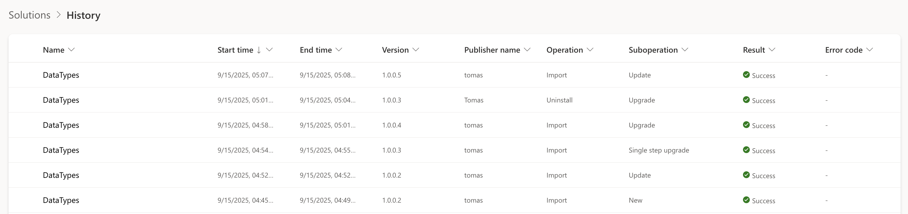

Dataverse solutions, Solution Component Framework (SCF), solution imports/exports and related tooling have undergone evolution since its introduction. Originally, solutions were primarily used for packaging customizations and patches, with imports handled through the web UI or custom scripts. Today platform includes multiple deployment methods: Maker UI, PAC CLI, Package Deployer, Azure DevOps tasks + GitHub Actions (which are essentially [wrappers over PAC CLI](https://github.com/microsoft/powerplatform-cli-wrapper)), Power Platform Pipelines, Package Deployer Service (App Source and Catalog).

> [!IMPORTANT]  
> Unmanaged solutions are only supposed to be used for export to source control and hydrating developer environments.
> This post doesn't consider deploying unmanaged solutions beyond developer environment as a valid option.

## Solution component types

There are two distinct generations of solution components:

### Platform components
 Implemented directly in the Dataverse codebase and identified by fixed, well-known component-type codes. A full list is published in the [SolutionComponent entity reference](https://learn.microsoft.com/en-us/power-apps/developer/data-platform/reference/entities/solutioncomponent#BKMK_ComponentType). `solution.xml` includes a list of RootComponents contained in the solution. Their definitions are mostly included in `customizations.xml` file inside the solution ZIP file. Solution Packager can pack/unpack `customizations.xml` into individual files to make the the content source control friendly.

### SCF components
Built with the Solution Component Framework (SCF) – their definitions are brought to environments dynamically via Microsoft first-party solutions developed by feature teams independently. These components are entities with a solution-aware type and extra configuration. Only Microsoft can create and ship SCF components. Their type codes are assigned at runtime, differ between environments and are always greater than 1000. When you create component instances in your solutions they get stored as records in component entities. These records get imported and exported with your third-party solutions. On import Dataverse tries to match file names from solution.zip with `solutioncomponentdefinition` unique component names in your environment. Component entities might optionally implement plugins on standard messages that are executed by import/handler handlers.

To discover SCF components in a given environment, query the `solutioncomponentdefinitions` table:

```http
GET ORG/api/data/v9.2/solutioncomponentdefinitions?$select=name,objecttypecode
```

#### Downsides
* Worse readability in source control which is not friendly for code review or conflict resolution
* Component owners (Microsoft) need to decide and cofigure how components are exported including files and formats to make it code review / merge conflict resolution friendly
* You cannot validate schema easily since there is no static reference
* Most components do not run proper schema validation during import and will let you import invalid values

## Solution import types
Solution imports are handled by Dataverse which stores environment metadata and supports several import types. Each client calls either Dataverse SOAP web service (legacy) or OData API. There are multiple types of import supported by three API endpoints / request types:

| Import Type         | UI Action Title      | Import History Operations                | Import Job Record Context | SDK Message                                         | Supports SmartDiff | PAC CLI Command                        | Description                                                                                   |
|---------------------|---------------------|------------------------------------------|---------------------------|-----------------------------------------------------|--------------------|----------------------------------------|-----------------------------------------------------------------------------------------------|
| New                 | -                   | Import & New                             | ImportInstall             | `ImportSolutionRequest`                               | No                 | `pac solution import`                  | Imports new solutions which do not exist in the environment                                   |
| Update              | Update              | Import & Update                          | ImportUpgrade             | `ImportSolutionRequest`                               | Yes <br />(Overwrite Unmanaged Customizations set to false)              | `pac solution import`                  | Updates existing solution while preserving unmanaged customizations. **Faster but doesn't delete removed components** |
| Holding Solution + Apply Upgrade | Stage for Upgrade   | Import & Upgrade <br />+ Import & Uninstall     | ImportHolding              | `ImportSolutionRequest` (`HoldingSolution`=true) <br />+ `DeleteAndPromoteRequest` | No                 | `pac solution import --import-as-holding` <br />+ `pac solution upgrade` | Imports as holding solution, then applies upgrade to remove old base + patches                |
| Single Step Upgrade | Upgrade             | Import & Single Step Upgrade              | ImportUpgrade              | `StageAndUpgradeRequest`                              | Yes <br />(Overwrite Unmanaged Customizations set to false)                | `pac solution import --stage-and-upgrade` | New version of upgrade operation committed as a single transaction (2024+)        |

The following screenshot displays the Solution Import History page, which lists details of solution import operations within Power Apps Maker. The table includes columns for both main operations and suboperations, allowing users to identify the type of import performed. Refer to the table above for guidance on interpreting the operation and suboperation values.


## Upload and validation before import via a staging endpoint
Solutions can be uploaded and validated in a separate request. This process involves first using `StageSolutionRequest` to upload and validate the solution ZIP, which returns validation results and upload ID (`StageSolutionResults.StageSolutionUploadId`). The file gets stored in `StageSolutionUpload` entity.

You can then execute:
* update via `ImportSolutionAsyncRequest`
* two-step upgrade via `ImportSolutionAsyncRequest` with `HoldingSolution=true` followed by `DeleteAndPromoteRequest`
* single-step upgrade via `StageAndUpgradeAsync`

You must include `SolutionParameters.StageSolutionUploadId` in both `ImportSolutionAsyncRequest` and `StageAndUpgradeAsync` to pass the upload ID. Only `Async` message versions support this.

This approach decouples validation from deployment, allowing for pre-import checks. This is used by PAC CLI and Power Platform Maker UI which uploads and validates the ZIP file before starting import.

> [!IMPORTANT]  
> `StageSolutionRequest` does not import a second holding solution to the system and therefore doesn't support migrations.
> It is not the same thing as Stage for upgrade!

## Import speed evolution
Dynamics CRM 2011 had no supported way of deleting components during upgrade, so developers used a "holding solution" trick (export, unzip, rename solution, import, delete old, re-import with the right name, then remove the temporary holding solution). Dynamics CRM 2016 introduced "Stage for upgrade" and "Apply solution upgrade". This imports a new temporary solution (with `_Upgrade` suffix in the name) above the base solution layer and below other solution layers. Applying the upgrade executes `DeleteAndPromoteRequest` to remove the old version and any components not present in the new package. This proces is **very slow** as it manipulates all components multiple times. In v9.0 the UI added an "Upgrade" option that performed both steps in one operation. If an error occurred it left `_Upgrade` solution behind.

Around 2020 Microsoft started optimizing solution "Update" (in the cloud SKU) by storing solution ZIP blobs and comparing metadata changes between imports. Only changed components are processed if this `SmartDiff` feature is used for an import job. It significantly improves import times (usually >50% time reduction).

In 2024 a modernized single-step upgrade (`StageAndUpgradeRequest`) option was introduced and it can process "Upgrade" in one atomic operation. If it fails you're not left with a hanging holding solution and the transaction gets rolled back with an error report. This new operation can also use `SmartDiff` the same way as "Update" does.

## Solution version numbers
Power Platform Maker UI presents selection between "Update", "Upgrade" and "Stage for Upgrade" options when the system already contains the same managed solution with a lower version number. If you try to import a solution which already exists in the system and the version number is the same "Update" import type will be used. You can't upload lower versions through UI (as of 2025) but [it was recently allowed through CLI/API](https://github.com/microsoft/powerplatform-build-tools/discussions/743#discussioncomment-8421894) to enable scenarios for rollback in Power Platform pipelines.

## Speeding up imports by skipping lower/same versions
For projects with components segmented into multiple solutions, import speeds can be improved by implementing custom build step that increments solution versions only when changes are detected in the solution project folder or its references. Tools similar to GitVersion can be used to determine the solution version number during the build process and overwrite the value in `solution.xml`. During imports, solutions with version numbers matching those already present in the system can be skipped, and their solution ZIP files would not even get uploaded to Dataverse. This approach can speed up deployments in projects with many solutions. 

If you use Package Deployer, it defaults to skipping lower versions, but this behavior can be overridden in its custom code if needed. For PAC CLI, you can use the `--skip-lower-version` flag with the `pac solution import` command to achieve similar results.

## About two-step upgrades and why they are still useful
Although the new single-step upgrade avoids a temporary `_Upgrade` solution entirely, the two-step flow is still useful when you need controlled migration process. "Stage for upgrade" option imports your higher version solution, but defers the deletion of the previous version until you apply a solution upgrade later. This option should only be selected if you want to have both the old and new solutions installed in the system concurrently so that you can do some data migration before you complete the solution upgrade. Applying the upgrade will delete the old solution and any components that are not included in the new solution.

### Migrations
For example, you can stage the new version, run migrations or transform data (you can use Package Deployer [RunSolutionUpgradeMigrationStep](https://learn.microsoft.com/en-us/dotnet/api/microsoft.xrm.tooling.packagedeployment.crmpackageextentionbase.iimportextensions.runsolutionupgrademigrationstep?view=dataverse-sdk-latest)), then apply the upgrade.

> [!NOTE]  
> Pakage Deployer scans your package assembly to see if there is custom code in RunSolutionUpgradeMigrationStep override.
> If it finds custom code it will use the two step upgrade and invoke your code before applying the upgrade.

### Dependency cleanup
It also helps with dependency cleanup across layers: when removing a component referenced by higher layers, import affected solutions as holding and then apply upgrades top-down (reverse order) so the upper layer drops the dependency before the base layer is upgraded. Example: UI solution references a table you plan to drop from the Data Model solution. If you upgrade the Data Model first the delete is blocked by dependencies from the UI solution.

## SmartDiff: The Game Changer

SmartDiff technology, available since 2021, dramatically accelerates both Update and Single-Step Upgrade operations by:

- **Component-level analysis**: Only processing changed components
- **Metadata comparison**: Skipping identical component definitions
- **Dependency optimization**: Processing only affected dependency chains
- **Performance gains**: Achieving 50-90% time reduction in typical scenarios

SmartDiff works automatically with Update imports and Single-Step Upgrades but requires proper version management to be effective.

## Troubleshooting Import Performance

When diagnosing slow imports or SmartDiff effectiveness:

### Import Job Analysis
Query the `importjob` table to examine component-level timing:
```sql
-- Identify slow components
SELECT TOP 10 
    componentname,
    componenttype,
    processed,
    DATEDIFF(second, startedon, completedon) as duration_seconds
FROM importjob 
WHERE importjobid = 'your-import-job-id'
ORDER BY duration_seconds DESC
```

### Solution History Tracking
Use `msdyn_solutionhistory` to track import patterns and identify trends.

### XrmToolBox Integration
The Solution History tool provides visual analysis of import performance and SmartDiff effectiveness.

## Package Deployer: Advanced Control

Package Deployer offers the most sophisticated deployment capabilities:

- **Deterministic solution ordering** with explicit dependency management
- **Custom code execution** for complex upgrade scenarios
- **Import type override** per solution within a package
- **Post-deployment automation** for data setup and configuration
- **Version checking**: Automatically skips deployment if solution versions match (additional performance optimization)

## Critical Tooling Requirements

**Warning**: Many organizations still use outdated tooling that doesn't support modern import types.

### Required Versions
- **PAC CLI**: Latest version for StageAndUpgrade support
- **Package Deployer PowerShell**: Version 3.3.0.1039+ (contains Package Deployer 4.0.0.183+)
- **Azure DevOps Tasks**: Avoid community tasks like `dyn365-ce-vsts-tasks` that reference outdated PowerShell versions

### Verification
Test that PowerShell version 3.3.0.1039 contains Package Deployer 4.0.0.183, which supports single-step upgrades.

## How does Git integration relate to this?


## Conclusion

The evolution from two-step to single-step upgrades, combined with SmartDiff optimization, represents a significant advancement in Power Platform ALM. Organizations should prioritize upgrading their tooling to leverage these performance improvements while maintaining the flexibility of Package Deployer for complex scenarios.

The key is understanding when to use each approach: single-step upgrades for standard deployments, two-step upgrades for complex migrations, and Package Deployer for enterprise-grade deployment automation with custom logic.
